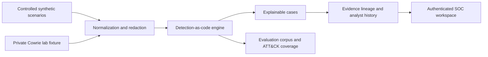

# MIRAGE SOC Lab

[](https://github.com/MohammadThabetHassan/mirage-soc-lab/actions/workflows/quality.yml)
[](https://github.com/MohammadThabetHassan/mirage-soc-lab/actions/workflows/codeql.yml)
[](https://nodejs.org/)
[](https://pnpm.io/)
[](#defensive-scope)

**MIRAGE** is a local-first Security Operations Center simulation and evaluation platform. It generates safe synthetic telemetry, applies deterministic detection-as-code rules, stores explainable analyst cases, and presents a traceable SOC workflow for training, evaluation, and security-engineering demonstrations.

> **MIRAGE is a controlled-lab application.** It does not scan external systems, test credentials, collect public telemetry, or interact with third-party infrastructure. It is not an autonomous production SOC.


_The signal prism is MIRAGE’s compact project mark. The social-preview artwork remains configured separately in GitHub repository settings and does not appear in this README. The GitHub Pages showcase links every public claim back to a versioned repository source._

> **Public showcase:** explore the [MIRAGE practical detection-engineering site](https://mohammadthabethassan.github.io/mirage-soc-lab/) for controlled use cases, ATT&CK-aware detection contracts, and a reproducible validation path.

## Why MIRAGE

| Capability                   | What it provides                                                                                                                                                  |
| ---------------------------- | ----------------------------------------------------------------------------------------------------------------------------------------------------------------- |
| Controlled telemetry         | Deterministic scenario replay and bounded, redacted imports from a private Cowrie lab fixture.                                                                    |
| Detection-as-code            | Versioned rules, thresholds, scoring rationale, ATT&CK context, and regression scenarios.                                                                         |
| Explainable analyst workflow | Evidence timelines, risk-factor breakdowns, analyst notes, dispositions, and case histories.                                                                      |
| Integrity assurance          | Atomic persistence, append-only disposition history, hash-chained evidence lineage, and verification status.                                                      |
| Repeatable quality           | Formatting, unit tests, strict TypeScript, production build, bundle budget, MySQL integration, CodeQL, dependency audit, and desktop/mobile browser smoke checks. |

## System overview



The detailed design is available in [Architecture](docs/ARCHITECTURE.md), while [Security Assurance](docs/SECURITY_ASSURANCE_MATRIX.md) records the control baseline, evidence, and remaining deployment prerequisites.

## Defensive scope

MIRAGE intentionally accepts only the following safe inputs and operations.

| Boundary              | Enforced behavior                                                                                                                                |
| --------------------- | ------------------------------------------------------------------------------------------------------------------------------------------------ |
| Scenario generation   | Uses deterministic, built-in synthetic scenarios only.                                                                                           |
| Cowrie import         | Requires an administrator, accepts a bounded JSON-lines payload, allowlists supported event types, and rejects non-private or malformed records. |
| Data handling         | Does not persist passwords, TTY logs, raw Cowrie records, file-transfer content, or supplied sensitive fields.                                   |
| Analyst workflow      | Requires authentication; notes and dispositions retain the authenticated analyst attribution.                                                    |
| Demonstration profile | The optional Cowrie Compose profile uses an internal network and exposes no Cowrie port.                                                         |

## Quick start

### Prerequisites

Install **Node.js 22+**, **pnpm 10.4.1**, and a **MySQL-compatible database**. For self-hosting, provide a compatible OAuth deployment and use a private `.env` file that is never committed.

| Variable                | Purpose                                                              |
| ----------------------- | -------------------------------------------------------------------- |
| `DATABASE_URL`          | MySQL-compatible database connection string.                         |
| `JWT_SECRET`            | Session-signing secret. Use a unique, high-entropy production value. |
| `VITE_APP_ID`           | Application identifier used by the OAuth integration.                |
| `OAUTH_SERVER_URL`      | Compatible OAuth service base URL.                                   |
| `VITE_OAUTH_PORTAL_URL` | OAuth portal URL used by the client sign-in flow.                    |
| `OWNER_OPEN_ID`         | Required production administrator identity.                          |

```bash
cp .env.example .env
# Edit .env with local development values. Do not commit it.
pnpm install
pnpm db:push
pnpm dev
```

Open the local URL, choose **Sign in to continue**, and complete the configured OAuth flow. The dashboard remains authenticated because it records analyst dispositions and notes.

> Never reuse production credentials in development and never copy platform-provided values into an external deployment.

## Demonstration walkthrough

1. Select **Full pipeline story** and choose **Run demo scenario**.
2. Review the three generated cases: repeated authentication failures, success after failure, and multi-stage decoy/discovery activity.
3. Open a case to inspect its evidence timeline, deterministic risk factors, and ATT&CK mapping.
4. Record an analyst note and disposition, then review the immutable history and integrity-verification status.
5. Open **Evaluation** to review deterministic scenario metrics. The benign-admin scenario should produce no cases.

## Practical use cases

MIRAGE is designed for controlled practice and validation rather than production monitoring. Each scenario is a versioned playbook with a learning objective, three validation steps, and an expected outcome in the detection catalog. The **Evaluation** workspace surfaces this guidance beside the observed result so an analyst can connect an exercise to a testable decision.

| Exercise              | Practical question                                                                                  | Expected result                                                              |
| --------------------- | --------------------------------------------------------------------------------------------------- | ---------------------------------------------------------------------------- |
| Full pipeline story   | Did a rule or parser change preserve the complete credential-to-decoy-to-discovery detection path?  | All three documented detections appear with source-bound evidence.           |
| Credential probe      | Does a success after failures deserve review when source continuity and time window are considered? | Two explainable lab detections appear; the triage boundary remains explicit. |
| Benign admin activity | Does approved administration remain outside the detection boundary?                                 | No case is created; the scenario acts as a negative control.                 |
| Threshold boundary    | Does the repeated-failure rule start precisely at its configured threshold?                         | No case is created one event below the threshold.                            |

## Verification and quality gates

| Command                 | Purpose                                                                                                        |
| ----------------------- | -------------------------------------------------------------------------------------------------------------- |
| `pnpm format:check`     | Enforces repository formatting.                                                                                |
| `pnpm test`             | Runs server, detection, integrity, authorization, and authenticated workflow tests.                            |
| `pnpm check`            | Runs strict TypeScript validation.                                                                             |
| `pnpm build`            | Produces the browser and server production bundles.                                                            |
| `pnpm test:persistence` | Runs the real-MySQL persistence test when `DATABASE_URL` is configured.                                        |
| `pnpm test:browser`     | Runs desktop and mobile browser, semantic, and keyboard smoke tests.                                           |
| `pnpm security:audit`   | Audits production dependencies at the configured severity threshold.                                           |
| `pnpm check:bundle`     | Enforces the production JavaScript bundle budget after a build.                                                |
| `pnpm check:showcase`   | Verifies required public content, GitHub links, safety statement, and responsive CSS in the static Pages site. |
| `pnpm quality`          | Runs formatting, unit tests, type checks, production build, and bundle budget.                                 |

The GitHub workflow requires quality, dependency-audit, browser-smoke, and disposable-MySQL migration/persistence jobs for changes pushed to `main` and pull requests targeting `main`. Pull requests also receive a least-privilege dependency review. CodeQL scans TypeScript and GitHub Actions on changes to `main`, pull requests, and a weekly schedule; results are published to GitHub Code Scanning and retained as SARIF evidence for fourteen days. Browser reports are retained for seven days only when a smoke-test job fails. A separate GitHub Pages workflow validates and deploys only the versioned static showcase after changes to `showcase/` or its deployment contract.

## Documentation

| Document                                                                     | Purpose                                                                       |
| ---------------------------------------------------------------------------- | ----------------------------------------------------------------------------- |
| [Architecture](docs/ARCHITECTURE.md)                                         | Component boundaries, data flow, trust boundaries, and persistence model.     |
| [Production Excellence Plan](docs/PRODUCTION_EXCELLENCE_PLAN.md)             | Researched hardening roadmap and assurance target.                            |
| [Security Assurance Matrix](docs/SECURITY_ASSURANCE_MATRIX.md)               | ASVS-inspired control coverage, evidence, and residual risks.                 |
| [Authorization and Abuse Controls](docs/AUTHORIZATION_AND_ABUSE_CONTROLS.md) | Role policy, rate limits, and distributed-scaling boundary.                   |
| [Data Governance](docs/DATA_GOVERNANCE.md)                                   | Integrity, migration, and retention procedures.                               |
| [Operations Runbook](docs/OPERATIONS_RUNBOOK.md)                             | Health checks, request IDs, incident triage, and release operations.          |
| [Release Readiness](docs/RELEASE_READINESS.md)                               | Verified release evidence and documented limitations.                         |
| [Release Procedure](docs/RELEASE_PROCEDURE.md)                               | Versioning, migration, deployment, and post-release verification steps.       |
| [Public Release Checklist](docs/PUBLIC_RELEASE_CHECKLIST.md)                 | Safe visibility-change, social-preview, security, and governance actions.     |
| [Dependency Security](docs/DEPENDENCY_SECURITY.md)                           | Dependency audit policy and remediation history.                              |
| [Detection Engineering Guide](docs/DETECTION_ENGINEERING_GUIDE.md)           | Rule contract, ATT&CK context, telemetry prerequisites, and safe triage.      |
| [GitHub Pages Guide](docs/GITHUB_PAGES.md)                                   | Static showcase source, deployment permissions, and verification procedure.   |
| [Contributing](CONTRIBUTING.md)                                              | Local development, test, review, and pull-request expectations.               |
| [Security Policy](SECURITY.md)                                               | Vulnerability-reporting route and security expectations.                      |
| [Citation Metadata](CITATION.cff)                                            | Standard software citation for training, research, and demonstrations.        |
| [Visual Assets](docs/assets)                                                 | Compact README brand mark and the separate GitHub social-preview upload file. |
| [Public Showcase](https://mohammadthabethassan.github.io/mirage-soc-lab/)    | Practical use cases, detection contracts, and repository-linked evidence.     |

## Detection and ATT&CK context

The included deterministic rules model repeated authentication failures, success after failure, and a multi-stage decoy/discovery sequence. The evaluation corpus labels known positives, a known benign case, and an edge case. Each scenario also records its learning objective, validation steps, and expected outcome. Each rule records technique, tactic, rationale, telemetry prerequisites, triage boundary, caveat, and reference links.

- [T1110 — Brute Force](https://attack.mitre.org/techniques/T1110/)
- [T1078 — Valid Accounts](https://attack.mitre.org/techniques/T1078/)
- [T1087 — Account Discovery](https://attack.mitre.org/techniques/T1087/)

## Contributing and support

Constructive contributions that preserve MIRAGE’s controlled defensive scope are welcome. Start with [CONTRIBUTING.md](CONTRIBUTING.md), follow the project’s [Code of Conduct](CODE_OF_CONDUCT.md), and review the security boundary in [SECURITY.md](SECURITY.md). For feature requests, support questions, and roadmap proposals, use the repository issue templates. MIRAGE is available under the [MIT License](LICENSE).
