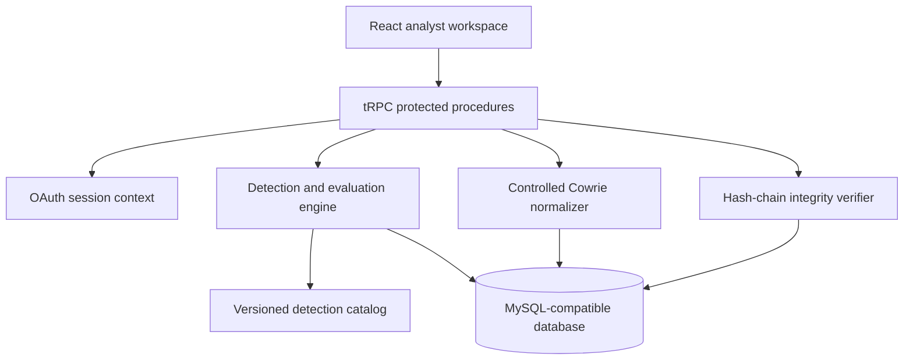

# MIRAGE Architecture

## Purpose and boundary

MIRAGE is an authenticated, controlled SOC-lab application. It is designed to demonstrate explainable detection engineering and analyst decision workflows using deterministic synthetic telemetry and a bounded private-lab Cowrie import path. It is not designed to monitor or act against public infrastructure.

## Logical architecture

## Component responsibilities

| Component                    | Responsibility                                                                                        | Security and reliability boundary                                                                                                               |
| ---------------------------- | ----------------------------------------------------------------------------------------------------- | ----------------------------------------------------------------------------------------------------------------------------------------------- |
| React workspace              | Renders cases, evaluation evidence, analyst notes, and integrity status.                              | Does not make authorization decisions; uses protected server procedures.                                                                        |
| tRPC router                  | Validates inputs, enforces authenticated or administrator-only operations, and applies action limits. | Rejects unauthorized, malformed, or oversized requests before persistence.                                                                      |
| Authentication context       | Supplies the authenticated user and role to protected procedures.                                     | The OAuth provider and session configuration are deployment prerequisites.                                                                      |
| Cowrie normalizer            | Maps an allowlisted controlled event subset into normalized lab events.                               | Drops raw records and prohibited/sensitive fields; accepts controlled source ranges only.                                                       |
| Detection catalog and engine | Produces deterministic findings from scenario data and catalog-defined thresholds.                    | Catalog schema validation protects against incomplete or malformed rule changes.                                                                |
| Persistence layer            | Stores scenarios, events, cases, notes, disposition history, and lineage records.                     | Atomic writes protect scenario and disposition consistency; schema indexes and uniqueness constraints protect query and relationship integrity. |
| Integrity verifier           | Recomputes evidence and disposition hash chains.                                                      | Detects inconsistency in stored application chains; does not replace external evidence signing or anchoring.                                    |
| Observability middleware     | Emits request metadata with a request ID and exposes health endpoints.                                | Logs exclude request bodies, cookies, authorization headers, and query values.                                                                  |

## Trust boundaries

| Boundary                           | Trusted inputs                                                     | Rejected or constrained inputs                                                                                       |
| ---------------------------------- | ------------------------------------------------------------------ | -------------------------------------------------------------------------------------------------------------------- |
| Browser to API                     | Authenticated session and validated procedure inputs.              | Anonymous access to SOC data; uncontrolled payload sizes; unvalidated procedure inputs.                              |
| Analyst to Cowrie import           | Administrator identity and bounded JSON-lines payload.             | Public-source records, unsupported event IDs, raw password/TTY/file-transfer content, and direct network collection. |
| Detection engine to database       | Catalog-validated deterministic scenario output.                   | Runtime execution of user-supplied detection logic.                                                                  |
| Application to deployment services | Injected database and OAuth configuration.                         | Missing required production configuration, secrets committed to source, or unreviewed environment drift.             |
| CI to repository                   | Read-only workflow permissions unless a job explicitly needs more. | Privileged untrusted pull-request execution and unreviewed dependency changes.                                       |

## Primary data flow

1. An authenticated analyst selects a deterministic scenario, or an administrator submits a redacted controlled-lab Cowrie payload.
2. The API validates the request, checks the action policy, and normalizes allowed data.
3. The detection engine applies the versioned catalog to produce explainable cases and evidence references.
4. The persistence layer stores scenario output and lineage together in a transaction.
5. An analyst records a disposition and note; the application appends a hashed history entry and updates the current-state projection atomically.
6. The workspace retrieves the case detail and recomputes integrity state through a protected verification procedure.

## Persistence model

| Record                     | Retention role                           | Integrity control                                                          |
| -------------------------- | ---------------------------------------- | -------------------------------------------------------------------------- |
| `scenario_runs`            | Reproducible evaluation and demo history | Linked to deterministic scenario metadata.                                 |
| `soc_events`               | Normalized controlled telemetry          | Source boundary and field-level redaction precede persistence.             |
| `soc_cases`                | Current case projection                  | Rule version and evidence data are retained for explanation.               |
| `case_notes`               | Analyst-facing note projection           | Created atomically with disposition history.                               |
| `case_disposition_history` | Append-only analyst decision record      | Per-case hash chaining and uniqueness of entry hashes.                     |
| `case_evidence_lineage`    | Append-only case-to-event lineage        | Per-case hash chaining and uniqueness per event/rule/version relationship. |

## Deployment assumptions

MIRAGE requires Node.js 22+, pnpm, a MySQL-compatible database, and a compatible OAuth provider. Production environments should use managed secret injection, encrypted database storage and backup procedures, HTTPS termination, externally monitored health checks, and a shared rate-limit backend if horizontally scaled.

## Non-goals

MIRAGE intentionally does not provide public honeypot deployment, credential testing, target scanning, exploit execution, automated containment, SIEM-scale ingest, or external threat-response actions.
