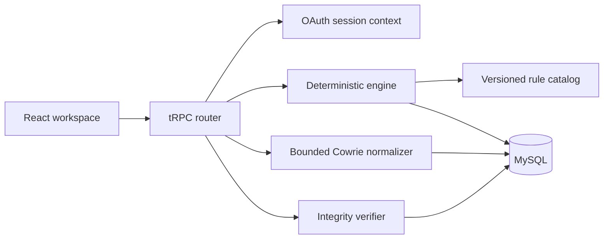

# MIRAGE Architecture

MIRAGE is a React and tRPC application built around one idea: a detection should be easy to replay, inspect, and challenge with a control case. It stores controlled scenario output in MySQL so an analyst can follow a case from telemetry to disposition without pretending to be a production SOC.

## Main pieces

| Part               | What it does                                                                                                       |
| ------------------ | ------------------------------------------------------------------------------------------------------------------ |
| React workspace    | Shows scenarios, cases, evaluation output, guided exercises, notes, and integrity status.                          |
| tRPC router        | Validates input, checks whether the caller is signed in or an administrator, and applies action limits.            |
| Session layer      | Reads the OAuth session and makes the user and role available to protected procedures.                             |
| Catalog and engine | Validate the versioned rule catalog and run deterministic correlation logic against controlled events.             |
| Cowrie normalizer  | Accepts only the allowlisted private-lab event subset and strips unsupported or sensitive fields before storage.   |
| MySQL layer        | Stores scenarios, events, cases, notes, dispositions, and evidence lineage in transactions.                        |
| Integrity verifier | Recomputes the case evidence and disposition hash chains to show whether stored application history still matches. |

## What happens during a replay

1. A signed-in analyst chooses a fixed scenario. An administrator can also submit a bounded Cowrie JSON-lines payload from a private lab.
2. The API validates the request and applies the action limit for that operation.
3. The engine reads the catalog and creates only the cases the scenario is expected to produce.
4. The application stores scenario output, evidence links, and case state together.
5. A later note or disposition appends an entry to the case history. The current case view and the append-only history are updated together.
6. The workspace can ask the verifier to recompute the stored chains.

The engine never evaluates uploaded rule code. Rule behavior comes from the checked-in catalog and deterministic implementation.

## Boundaries that matter

MIRAGE trusts the application’s OAuth configuration, its database connection, and its checked-in catalog. It does not trust browser input, raw fixture input, or a rule match by itself.

The server validates tRPC input with Zod, limits JSON bodies to 2 MB, and keeps request logs to metadata such as request ID, route, method, status, and duration. It does not log request bodies, cookies, authorization headers, or query values. `/healthz` says that the process is running; `/readyz` also reports whether the configured database is reachable.

The Cowrie import is intentionally narrow. It is for recorded private-lab telemetry, not public collection. Unsupported event types, raw TTY content, file-transfer content, and fields outside the allowlist are not part of the normalized event model.

Rate limits are process-local sliding windows. They protect the single-instance lab but are not a claim of distributed rate limiting. A horizontally scaled deployment would need a shared limiter.

## Stored records

| Record                     | Why it exists                                                                                |
| -------------------------- | -------------------------------------------------------------------------------------------- |
| `scenario_runs`            | Reproducible replay and evaluation history.                                                  |
| `soc_events`               | Normalized controlled telemetry.                                                             |
| `soc_cases`                | The current analyst-facing case view, including rule and evidence context.                   |
| `case_notes`               | The current analyst note projection.                                                         |
| `case_disposition_history` | Append-only disposition entries protected by a per-case hash chain.                          |
| `case_evidence_lineage`    | Append-only links from a case to its source events, also protected by a per-case hash chain. |

Migrations live in `drizzle/`. Treat them as forward changes: review the generated SQL, run it against a disposable database, and write a compensating migration if a later correction is needed.

## Running and shipping

The server needs Node.js 22+, pnpm, MySQL, and OAuth settings for a full deployment. Production startup rejects missing or malformed database, OAuth, application ID, owner, and cookie-secret configuration.

The repository’s CI has four practical jobs: the normal quality command, production dependency audit, browser smoke tests, and a disposable-MySQL migration/persistence test. CodeQL scans the source and workflow files. The public project page is a separate static artifact in `showcase/`; its workflow checks the source first, then publishes it to GitHub Pages.

MIRAGE does not provide scanning, credential testing, exploit execution, public honeypot deployment, external telemetry collection, automated containment, or SIEM-scale ingest. Those are outside this project’s purpose.
